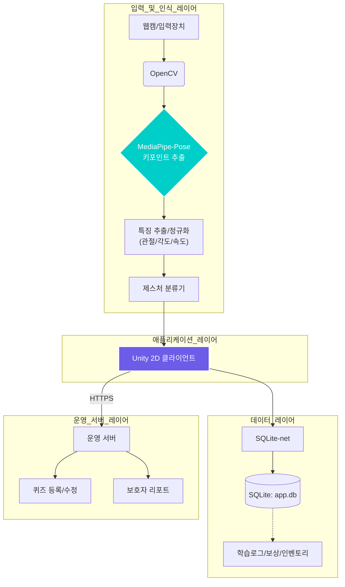

# Thread Of Feeling (동화 속 감정 여행)

[](LICENSE)
[](https://github.com/YOUR_GITHUB_USER/YOUR_REPO_NAME/issues)
[](https://unity.com/)

> **"세상과 연결되는 새로운 길"**
>
> 웹캠 기반의 제스처 인식과 전래동화 스토리텔링을 결합하여, 자폐 아동의 **감정 인식 능력**과 **사회적 상호작용**을 돕는 기능성 학습 게임입니다.

---

## 📖 목차

1. [프로젝트 소개](#1-프로젝트-소개)
2. [주요 기능](#2-주요-기능)
3. [시스템 아키텍처](#3-시스템-아키텍처)
4. [설치 및 실행](#4-설치-및-실행)
5. [팀원 및 역할](#5-팀원-및-역할)

---

## 1. 프로젝트 소개

### 💡 배경 (The Problem)
국내 발달 장애인(지적 장애 및 자폐성 장애) 인구는 지속적으로 증가하고 있습니다. 이들은 타인의 표정이나 말투에서 감정을 파악하거나, 대화를 유지하고 또래 관계를 형성하는 등 **사회적 의사소통**에 어려움을 겪습니다.

### 🧩 해결책 (Solution)
**Thread of Feeling**은 이러한 문제를 해결하기 위해 고안되었습니다.
* **친숙한 전래동화:** '흥부와 놀부' 등 익숙한 이야기를 통해 심리적 부담을 낮춥니다.
* **직관적 상호작용:** 복잡한 조작 대신 제스처(주먹 쥐기, 손 펴기)를 통해 게임과 소통합니다.
* **감정 학습:** 시나리오 속 상황에 맞는 감정을 선택하며 자연스럽게 사회성을 기릅니다.

---

## 2. 주요 기능

### 🎮 핵심 플레이
* **제스처 기반 퀴즈:** **MediaPipe Hands**를 활용하여 웹캠으로 손동작을 인식합니다. 왼손/오른손 구분 및 주먹/펴기 동작으로 2지선다 퀴즈를 수행합니다.
* **감정 시나리오:** 3가지 동화 타입과 5대 감정(기쁨, 슬픔, 화, 두려움, 놀람)을 상황별로 학습합니다.
* **실시간 피드백:** 정답 시 대화 팁을 제공하고, 오답 시 이유를 설명하여 재시도를 유도합니다.

### 🏡 보상 및 관리 시스템
* **하우징(Housing):** 동화를 완료하면 보상 아이템을 획득하며, 이를 사용해 **나만의 집**을 꾸밀 수 있어 지속적인 학습 동기를 부여합니다.
* **보호자 리포트:** 7가지 세부 항목 체크리스트를 통해 아동의 감정 인식 향상도와 상호작용 기록을 제공합니다.

---

## 3. 시스템 아키텍처

본 프로젝트는 Unity 클라이언트를 중심으로 입력, 데이터, 서버 레이어가 유기적으로 연결된 구조입니다.



---

## 4. 설치 및 실행

### 필수 요구 사항
* Windows 10/11
* Unity 2022.3 LTS 이상
* 웹캠 (필수)

### 설치 단계

**1. 프로젝트 클론**
```bash
git clone https://github.com/zxxxv/ThreadOfFeeling.git
```

**2. Unity 프로젝트 열기**
* Unity Hub에서 ThreadOfFeelingUnity 폴더를 엽니다.

**3. Python 환경 설정 (MediaPipe)**
* Assets/Python 경로의 requirements.txt를 통해 필요한 라이브러리를 설치합니다.
```Bash
pip install -r /ThreadOfFeelingUnity/requirements.txt
```

**4. 실행**
* Unity 에디터의 Scenes/Main 씬을 열고 플레이 버튼을 누릅니다.
* 초기 실행 시 카메라 권한 허용이 필요합니다.


## 5 팀원
| 역할 (Role) | 이름 (Name) | GitHub |
| :---: | :---: | :---: |
| Data Layer | 김채은 | [@coco](https://github.com/CoCo-1223) | 
| Input&Perception Layer | 오재식 | [@ohjaesik](https://github.com/ohjaesik) |
| Application Layer | 최재웅 | [@zxxxv](https://github.com/zxxxv/) |

